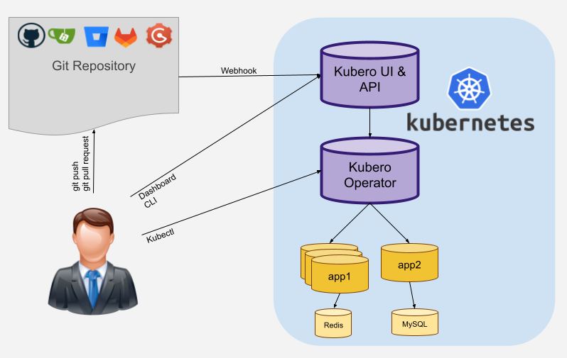
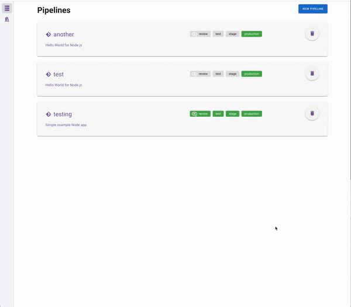

 

 
Kubero is a fully self-hosted Internal Developer Platform (IDP) that brings the workflows of Heroku to your Kubernetes cluster. It enables you to deploy your applications with a few clicks on the Dashboard or by CLI. It has a built-in CI/CD pipeline and supports multiple staging environments.
 
 
Kubero is Kubernetes native and runs with two containers on any Kubernetes instance.
 
 

## What can Kubero do for you?
- Create a CI pipeline with up to 4 separate staging environments for all your applications
- Build, start and cleanup review-apps after opening/closing a pull request
- Automatic deployment of the app based on a branch or tag
- Create scheduled tasks (cronjobs)
- Easy deployment of your apps on Kubernetes without helm charts
- Deploy add-ons for your application (PostgreSQL, Redis, more to come)
- Easy access of application logs in the UI
- Easy and safe restart of the application in the UI
- Periodic vulnerability scans of your running apps

## What Kubero won't do for you
- Manage your Kubernetes cluster
- Give access to your container CLI

## How it Works
1. Create a pipeline with the phases you need (dev, staging, production)
2. Connect the pipeline to your git repository (Github, Bitbucket, Gitlab, Gitea, Gogs)
3. Create your apps with cronjobs and addons

Kubero will then start an init container that will clone your repository and another init container to build your app. Kubero is now able to start the container and expose it to the internet. You can now access your app via the configured domain.

More <a href="https://github.com/kubero-dev/kubero/tree/main/docs/2screenshots.md">Screenshots</a> and a full video on
<a href="https://www.youtube.com/watch?v=-_XcC_8cpis" target="_blank">YouTube</a>

## Supported GIT repositories (hosted and self-hosted)
- Gitea
- Gogs
- Github
- Gitlab
- Bitbucket
- Forgejo (WIP)
- OneDev (WIP)

## Tested languages/frameworks
Basicly *everything* that can be shipped in a single container. Kubero uses official images to build and run the apps. But they can be replaced or extended to fit your needs.

- GoLang (including Hugo, gin-gonic)
- Python (including Flask)
- JavaScript/NodeJS
- PHP (including Laravel)
- Ruby (including Rails)
- Static HTML
- Rust (including Rocket)
- ...

You find the preconfigured buildpacks and examples here:
https://github.com/kubero-dev/buildpacks

## Preconfigured add-ons
The Kubero Operator ships with several basic addons that can be used in your apps.
- MySQL
- PostgreSQL
- Redis
- MongoDB
- Elasticsearch
- Kafka
- CouchDB
- RabbitMQ (WIP)
- CockroachDB (WIP)
- Minio (WIP)
- InfluxDB (WIP)

## 30+ Application templates (similar to Heroku Buttons)
- Wordpress
- Grafana
- <a href="https://uptime.kuma.pet" target="_blank">Kuma</a>
- <a href="https://github.com/zadam/trilium" target="_blank">Trilium Notes</a>
- ...

Check out the full [list here](https://www.kubero.dev/templates/) or submit your own app! [Read here](https://github.com/kubero-dev/kubero/blob/main/services/) how to do it.

## Quickstart
1) Download and unpack the <a href="https://github.com/kubero-dev/kubero-cli/releases/latest">Kubero CLI</a>

2) Run `kubero install` to install all components on an new or your existing cluster

You can bring your own cluster or create one with the kubero install on one of the following providers:
- GKE
- Scaleway
- DigitalOcean
- Linode
- Kind (local)

## Documentation
https://docs.kubero.dev/

## Roadmap
https://github.com/orgs/kubero-dev/projects/1/views/3

## Community

## Contributing
All contributions are welcome!
 - Open an issue
 - Add a feature or open a feature request
 - Discuss ideas in the discussions
 - Fix typos
 - Contribute code
 - Write articles

## Supporting this project
Starring this project is a huge motivation. ⭐ Thank you!

