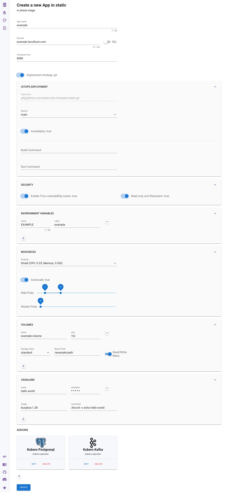
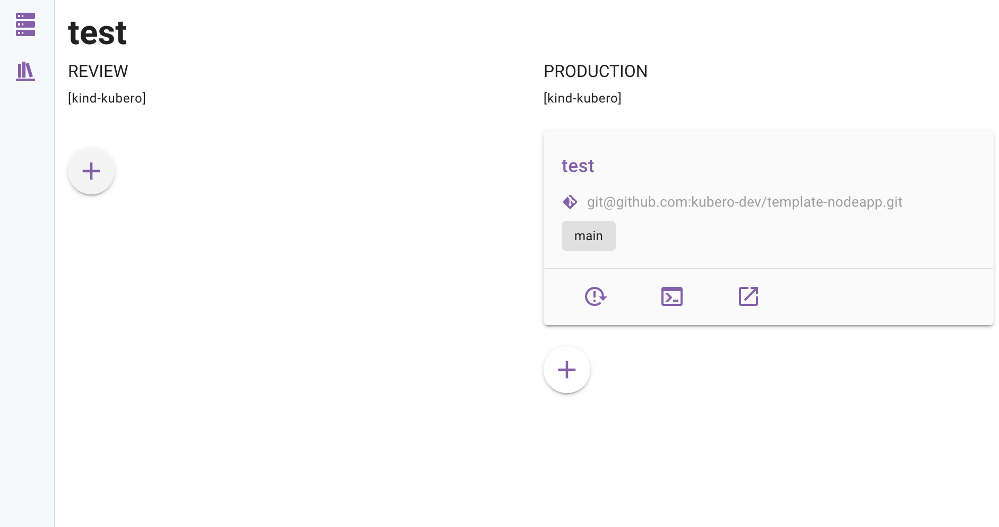

<br>
<br>
Kubero brings the convinience of Heroku/platform.sh to your kubernetes cluster. Your developers should not need to worry about the underlying infrastructure and deployment.
<br>
<br>


## What can Kubero do for you?
- Create a CI pipeline with up to 4 separate environments for all your standard apps: review apps -> testing -> stageing -> production
- Build, start and cleanup reviewapps after opening/closing a pull request
- Automatic deployment of the app based on a branch or tag
- Create Scheduled tasks (cronjobs)
- Easy deployment of your apps on kubernetes without helm charts
- Deploy addons (PostgreSQL, Redis, more to come)
- Easy access of application logs in the UI
- Easy and safe restart of the application in the UI

## What Kubero can't do for you
- Manage your Kubernetes cluster
- Install and Manage your operators
- Give access to your Contaier CLI

## Which heroku features are still missing?
- Dataclips
- CLI (May be added later since kubero has a API)
- Other Buildpacks (only NodeJS is currently supported, more to come soon)


## Screenshots
<a href="https://github.com/kubero-dev/kubero/tree/main/docs/screenshots">more Screenshots</a><p>



# Usage
1. Create a pipeline with all your phases
2. Connect the Pipeline to your git repository ( not required with pre-build image deployment )
3. Create your apps with cronjobs and addons

# Installation

## Cluster Requirements: 
- Kubernetes 1.19+
- OLM - Operator Lifecycle Manager


## Install the Operator
The operator will also install the UI and all the required CRD
```bash
TODO
```

## create the namespace
```bash
kubectl create namespace kubero
```

## Create and deploy the secrets
```bash
curl -sL https://raw.githubusercontent.com/kubero-dev/kubero-operator/main/helm-charts/kubero/secrets.yaml.example > secrets.yaml
# Edit the secret with your credentials
kubectl apply -f secrets.yaml -n kubero
```
| Variable | Required | Description |
|-------:|:-------:|:-----------|
| GIT_DEPLOYMENTKEY_PUBLIC | required | generated Public Key |
| GIT_DEPLOYMENTKEY_PRIVATE_B64 | required | Base64 encoded Private Key |
| KUBECONFIG_BASE64 | required | Base64 encoded Kubeconfig, may contain multiple contexts |
| KUBERO_WEBHOOK_SECRET | required | Random secret string
| GITHUB_PERSONAL_ACCESS_TOKEN | optional | Personal access token for GitHub API |
| GITEA_PERSONAL_ACCESS_TOKEN | optional | Personal access token for Gitea API |
GITLAB_PERSONAL_ACCESS_TOKEN | optional | Personal access token for GitLab API |

### To base64 encode your kubeconfig
```bash
cat kubeconfig | base64
```

## deploy the UI
```bash
kubectl apply -f https://raw.githubusercontent.com/kubero-dev/kubero-operator/main/config/samples/application_v1alpha1_kubero.yaml -n kubero
```

## configure Kubero
```bash
kubectl edit configmap kubero-config -n kubero
```

# Development

### local development
from local source
```bash
yarn dev
```

or with docker compose
```bash
docker-compose build
docker-compose up -d
```

### start a local kind cluster
```
kind create cluster --config kind.yaml
kubectl create -f https://raw.githubusercontent.com/operator-framework/operator-lifecycle-manager/master/deploy/upstream/quickstart/crds.yaml
kubectl create -f https://raw.githubusercontent.com/operator-framework/operator-lifecycle-manager/master/deploy/upstream/quickstart/olm.yaml
kubectl apply -f https://raw.githubusercontent.com/kubernetes/ingress-nginx/main/deploy/static/provider/kind/deploy.yaml
``` 

### Exporting the Kubernetes config file 

Local development
```bash
kind export kubeconfig --name kubero --kubeconfig ./kubeconfig
```

To use in the docker-compose 
```bash
kind get kubeconfig --internal --name kubero > ./kubeconfig-docker
```
