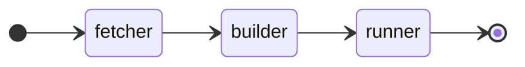

# Buildpacks

<link rel="stylesheet" type="text/css" href="https://cdnjs.cloudflare.com/ajax/libs/mermaid/7.0.11/mermaid.css">

Kubero buildpack-images rely on public available images.

Examples of Kubero Buildpacks can be found here: https://github.com/kubero-dev/buildpacks/tree/main/packs

> ℹ️  **Information**  
> Buildpacks have nothing in common with buildpacks.io. Your Code will not be built into the running image but mounted read-only into the running image.

Buildpacks are defined as a set of three containers:

## Fetch (init container)
Fetches the code from a Git repository.
There is a working fetch container from kubero. But if you wish to build your own, you are free to change it in the buildpack configuration.

## Build (init container)
Runs the build commands.
You can define which image will be used by selecting the buildpack. The buildpack can be configured with any Docker image.

## Run (container)
Run the final container
In the run stage, there are two options: worker and web. Only the web pod is attached to the ingress and will be accessible from outside the cluster.
